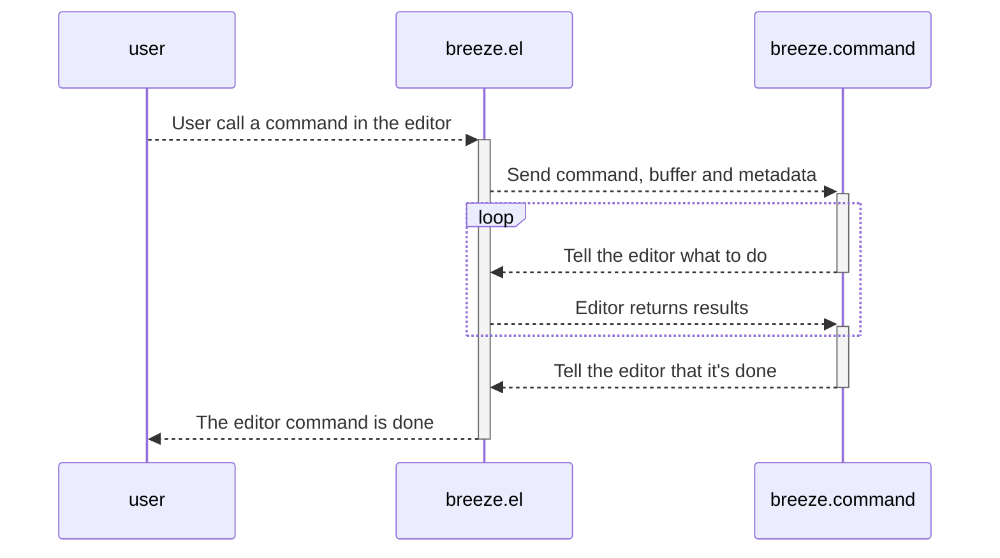
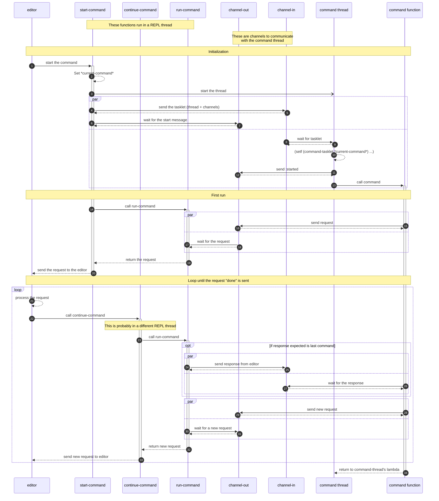

# TODO This is _waaay_ out of date

```mermaid
sequenceDiagram
    user-->>+breeze.el: User call a command in the editor
    breeze.el-->>+breeze.command: Send command, buffer and metadata
    loop
        breeze.command-->>-breeze.el: Tell the editor what to do
        breeze.el-->>+breeze.command: Editor returns results
    end
    breeze.command-->>-breeze.el: Tell the editor that it's done
    breeze.el-->>-user: The editor command is done
```

```mermaid
sequenceDiagram
    autonumber

    participant ed as editor

    participant start as start-command
    participant cont as continue-command
    participant run as run-command

    participant out as channel-out
    participant in as channel-in

    participant th as command thread
    participant cmd as command function


    Note over start, run: These functions run in a REPL thread
    Note over in, out: These are channels to communicate <br>with the command thread

    Note over ed, cmd: Initialization
    ed->>+start: start the command
    start-->>start: Set *current-command*
    start-)th: start the thread

    par
        start->>+in: send the tasklet (thread + channels)
        in-->>-start:
        start->>+out: wait for the start message
        out-->>-start:
    and
        in->>+th: wait for tasklet
        th-->>-in:
        th-->>th: (setf (command-tasklet *current-command*) ...)
        th->>+out: send :started
        out-->>-th:
        th->>+cmd: call command
    end


    Note over ed, cmd: First run
    start->>+run: call run-command

    par
        cmd->>+out: send request
        out-->>-cmd:
    and
        run->+out: wait for the request
        out-->>-run:
    end

    run-->>-start: return the request
    start-->>-ed: send the request to the editor

    Note over ed, cmd: Loop until the request "done" is sent
    loop
        ed-->>ed: process the request
        ed->>+cont: call continue-command
        Note over cont: This is probably in a different REPL thread
        cont->>+run: call run-command

        opt if response expected is last command
            par
                run->>+in: send response from editor
                in-->>-run:
            and
                cmd->>+in: wait for the response
                in-->>-cmd:
            end
        end

        par
            cmd->>+out: send new request
            out-->>-cmd:
        and
            run->>+out: wait for a new request
            out-->>-run:
        end

        run-->>-cont: return new request
        cont-->>-ed: send new request to editor
    end

    cmd-->>-th: return to command-thread's lambda
```
